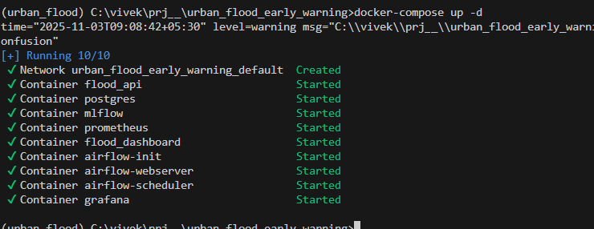
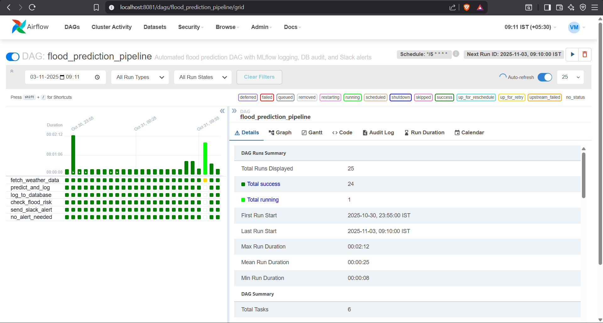
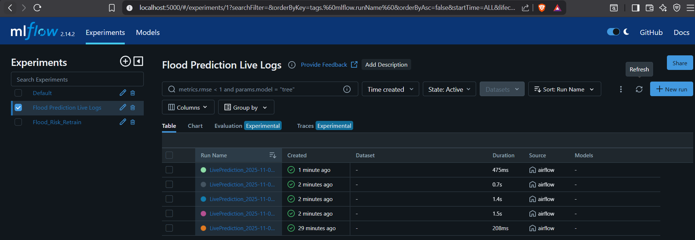

# 🌊 Urban Flood Early Warning System — End-to-End AI & MLOps Project


---

## 🧭 Project Overview

The **Urban Flood Early Warning System** is a highly-professional, production-ready **AI + MLOps platform** designed to predict flood risks in urban environments using real-time IoT sensor data and robust machine learning pipelines. This project exemplifies the integration of **data science**, **ML engineering**, **cloud computing**, and **devops/MLOps** to create a reliable disaster management tool that supports city authorities and citizens with real-time insights and actionable alerts.

> **Live: Interactive Demo**  
> 

---

## 🎯 Key Objectives

- Predict **urban flood events** with >90% accuracy.
- Process and analyze **real-time IoT sensor feeds** (rainfall, water level, humidity, etc.).
- Orchestrate automated **data ingestion**, **model retraining**, and **deployment pipelines** using MLOps best practices.
- Offer an intuitive **dashboard for continuous monitoring** and decision-making.
- Deploy scalable APIs and dashboards with **FastAPI** and **Streamlit**, fully containerized for production.

---

## 🧱 System Architecture

```
      ┌───────────────────────────┐
      │ Continuous Data Source    │
      │ (Simulated Live Weather)  │
      └──────────────┬────────────┘
                     │
                     ▼
      ┌──────────────────────────────────┐
      │ Apache Airflow (Orchestration)   │
      │ 1. Data Ingestion & Feature Eng. │
      │ 2. Prediction Run (Every 5 min)  │
      └──────────────┬───────────────────┘
                     │
            (Prediction Data)
                     │
                     ▼
      ┌─────────────────────────────────────────────┐
      │ PostgreSQL (Transactional Audit)            │
      │ - Logs Predictions & Telemetry              │
      └──────────────┬──────────────┬───────────────┘
                     │              │
                     │              │
                     ▼              ▼
      ┌────────────────────────┐  ┌──────────────────────────────┐
      │ Streamlit Monitor &    │  │ ML Model Training (XGBoost)  │
      │ Alerts (Monitoring)    │  │ (Triggered by Schedule)      │
      └────────────────────────┘  └─────────────┬────────────────┘
                                               │
                                               ▼
                              ┌─────────────────────────────────────────┐
                              │ MLflow Governance & Deployment          │
                              │ - Model Registry & Promotion to         │
                              │       Production' Registry              │
                              └──────────────┬──────────────────────────┘
                                             │
                                             ▼
                          ┌───────────────────────────────────────┐
                          │ FastAPI Inference Service             │
                          │ - Loads Production Model & Serves API │
                          └───────────────────────────────────────┘
```

---

## 🖼️ Solution Screenshots

### 🚀 Full Stack Boot — All Services Running

> *All major services (FastAPI, Streamlit, Airflow, Grafana, MLflow, Prometheus, PostgreSQL) up and orchestrated via Docker Compose for seamless integration and reproducibility.*  
<sup>*Image 1: Proof of modular, containerized MLOps stack boot.*</sup>

---

### 📡 Real-Time ML Pipeline Orchestration

> *Robust orchestration with Apache Airflow for data ingestion, model inference, database logging, and automated notifications (Slack alerting etc). Monitor DAG health and efficiency interactively.*  
<sup>*Image 3: Airflow automation for CI/CD and prediction scheduling.*</sup>

---

### 📈 MLflow Governance — Model Tracking & Live Logging

> *Continuous experiment tracking using MLflow, with live logging of all predictions, training, and experiment metadata. Enables auditability and production governance.*  
<sup>*Image 2: Transparent tracking of model experiments and inferencing.*</sup>

---

### 🌦️ Professional Dashboard for Monitoring & Analytics


> *Interactive dashboard built with Streamlit for dynamic monitoring: live risk stats, multi-city aggregation, visual analytics, and scenario simulation — designed for operational clarity and actionable decision-making.*  
<sup>*Image 4: End-user interface visualizing all facets of urban flood risk.*</sup>

---

## 📁 Project Directory Structure

```text
urban_flood_early_warning/
│
├── data/                        # Raw, processed, and prediction logs
│   ├── raw/
│   ├── processed/
│   └── prediction_log.csv
│
├── src/                         # Core ML pipeline modules
│   ├── components/              # Ingestion, Validation, Transformation
│   ├── pipeline/                # Training & Prediction pipelines
│   ├── utils/                   # Helper functions & utilities
│   └── entity/                  # Configurations & artifacts
│
├── app.py                       # FastAPI app for model inference
├── dashboard.py                 # Streamlit dashboard for monitoring
├── Dockerfile                   # Docker container setup
├── requirements.txt             # Dependencies list
├── .github/workflows/ci.yml     # GitHub Actions CI/CD pipeline
└── README.md                    # Documentation (you are here)
```

---

## 🧠 Technology Stack Overview

| **Category**         | **Stack**                       | **Role in Project**                             |
| :------------------- | :----------------------------- | :---------------------------------------------- |
| Programming Language | Python 3.10                     | Foundation for all ML and orchestration logic   |
| Orchestration        | Apache Airflow                  | DAGs for ETL, inference, retraining, automation |
| Model Registry/Governance | MLflow                    | Experiment and model lifecycle management       |
| Model Training       | XGBoost, Scikit-learn           | Ensemble modeling & evaluation                  |
| Real-Time Serving    | FastAPI                         | Lightning-fast model API                        |
| Monitoring           | Streamlit, Plotly               | Visualization dashboard                         |
| Database/Audit       | PostgreSQL                      | Transactional logging of inference data         |
| Containerization     | Docker, Docker Compose          | Environment reproducibility, isolation          |
| Metrics/Observability| Prometheus, Grafana             | API/Lifecycle monitoring                        |

---

## 🔁 ML & Data Workflow

1. **Data Ingestion:**  
   Automated via Airflow; uses both real-time sensor feeds (MongoDB, simulated weather) and historic data for training and inference.

2. **Validation & Transformation:**  
   Strict validation against `schema.yaml`, followed by feature engineering, outlier handling, and artifact management.

3. **Model Training & Governance:**  
   Ensemble models (Random Forest, XGBoost) tracked and registered with MLflow for traceability, versioning, and continuous optimization.

4. **Automated Inference & Retraining:**  
   Orchestrated by Airflow (see screenshot above), predictions and retraining jobs are managed with logs audited via PostgreSQL for full reliability.

5. **CI/CD Automation:**  
   End-to-end pipeline includes automated GitHub Actions CI/CD, enabling push-to-production with Docker for robust dev-to-deploy parity.

---

## ⚡ FastAPI Endpoints 

| **Endpoint**     | **Method** | **Description**                    |
| :-------------  | :--------- | :--------------------------------- |
| `/predict_flood`| POST       | Predict flood risk from sensor data|
| `/health`       | GET        | API health check                   |
| `/logs`         | GET        | Retrieve recent prediction logs    |

**Example Request:**
```json
{
  "rainfall": 45.2,
  "humidity": 80.1,
  "temperature": 28.3,
  "water_level": 4.5,
  "soil_moisture": 70.0
}
```
**Example Response:**
```json
{
  "flood_risk": "High",
  "probability": 0.87
}
```

---

## 🚀 Quickstart — Setup & Deployment

1. **Clone Repository**
    ```bash
    git clone https://github.com/VIVEK-MARRI/urban_flood_early_warning.git
    cd urban_flood_early_warning
    ```
2. **Set Up Python Environment**
    ```bash
    conda create -n floodenv python=3.10 -y
    conda activate floodenv
    pip install -r requirements.txt
    ```
3. **Configure Database**
    Edit `.env`:
    ```ini
    POSTGRES_USER=postgres
    POSTGRES_PASSWORD=yourpassword
    POSTGRES_DB=flood_db
    POSTGRES_HOST=localhost
    POSTGRES_PORT=5432
    ```

4. **Launch Complete Stack**
    ```bash
    docker-compose up --build
    ```
    >   
    *All MLOps and analytics services start up together in seconds.*

---

## ⏰ Airflow DAG/Job Schedules

| **DAG Name**         | **Purpose**                   | **Schedule**    |
|----------------------|-------------------------------|-----------------|
| data_ingestion_dag   | Load & clean IoT data         | @hourly         |
| model_training_dag   | Retrain models, log metrics   | @daily          |
| model_retrain_dag    | Auto-retrain on drift alert   | @weekly         |

DAGs are located in `airflow/dags/`.  
> 

---

## 📊 Model Monitoring, Observability & Explainability

- **MLflow**: Experiment/version tracking for absolute reproducibility
- **Data Drift**: Automated retraining if prediction distribution shifts
- **Explainability (SHAP)**: Full transparency into key risk features
- **PostgreSQL**: Transactional full-log for auditability
- **Prometheus + Grafana**: Real-time monitoring of system health

---

## 🥇 Key Milestones

- 🚀 Achieved >90% predictive accuracy (XGBoost stack)
- 🐳 End-to-end stack: Airflow, FastAPI, Streamlit, Prometheus, PostgreSQL, MLflow — all live via Docker Compose
- 🔄 Full CI/CD automation from ETL to deployment
- 📈 Interactive, real-time risk dashboard for users
- 🗃️ Unbreakable, version-locked data and model governance

---

## ☁️ Deployment: Service Map

| **Component**   | **Service**          |
|-----------------|---------------------|
| Backend API     | FastAPI             |
| Dashboard       | Streamlit           |
| Database        | PostgreSQL          |
| Orchestration   | Apache Airflow      |
| Containerization| Docker Compose      |
| Model Tracking  | MLflow              |

---

## 🔮 Future Roadmap

- Integrate satellite imagery (Sentinel) for spatial/remote flood mapping
- Ingest live rainfall data from public APIs for even fresher predictions
- Upgrade to LSTM/GRU deep learning models for robust temporal inference
- Container orchestration on Kubernetes (EKS, GKE) for scale
- Real-time alerts via email/SMS on critical risk

---

## 👨‍💻 Author

**Vivek Marri**  
AI/ML & MLOps Engineer  
📧 Email: vivekyadavmarri.com  
🌐 [LinkedIn](https://www.linkedin.com/in/vivek-marri-49419a274/)  
🐙 [GitHub](https://github.com/VIVEK-MARRI)  

---

## 🧾 License

MIT License — See the [LICENSE](LICENSE) file for details.

---

## 🏁 Professional Summary

This project delivers a truly production-grade, fully-automated, and observable AI + MLOps solution for urban flood disaster mitigation.  
From raw sensor to actionable dashboard — with bulletproof data, CI/CD, and model discipline — it demonstrates how modern engineering transforms real-world challenges into operational reliability.

```
**Note:** Add the provided image files (“images/docker_compose_up.png”, “images/mlflow_experiment.png”, “images/airflow_dag.png”, “images/streamlit_dashboard.png”) in the `images/` folder of your repo.  
Image mapping based on context:
- Image 1: `docker_compose_up.png` — Full stack boot/log proof
- Image 2: `mlflow_experiment.png` — MLflow live experiment tracking
- Image 3: `airflow_dag.png` — Airflow DAG orchestration view
- Image 4: `streamlit_dashboard.png` — Streamlit flood monitoring dashboard
