# 🌊 Urban Flood Early Warning System (UFEWS)
### Enterprise-Grade MLOps Platform for Disaster Risk Prediction

[](https://github.com/VIVEK-MARRI/urban_flood_early_warning/actions)
[](https://www.python.org/)
[](https://www.docker.com/)
[](https://github.com/psf/black)

---

## 📖 Project Overview
The **Urban Flood Early Warning System** is a production-ready MLOps solution designed to predict flood risks using real-time weather data. It demonstrates a complete end-to-end machine learning lifecycle, from data ingestion and versioning to model deployment and monitoring.

This project is built to simulate a real-world enterprise environment, ensuring **reproducibility**, **scalability**, and **observability**.

---

## 🏗 System Architecture

The following diagram illustrates the high-level architecture and data flow of the system.

```mermaid
graph LR
    subgraph Data_Layer ["Data Ops"]
        direction TB
        Raw["Raw Weather Data"] -->|DVC Tracking| DVC_Store[("DVC Local Storage")]
        DVC_Store -->|dvc pull| Pipeline
    end

    subgraph Pipeline ["Orchestration (Airflow)"]
        direction TB
        Ingest["Data Ingestion"] --> Preprocess[Preprocessing]
        Preprocess --> Train["XGBoost Training"]
        Train --> Evaluate["Model Evaluation"]
        Evaluate -->|Threshold Pass| Register["Register Model"]
    end

    subgraph Experimentation ["MLflow Platform"]
        Train -.->|Log Params & Metrics| Tracking["Tracking Server"]
        Register -.->|Version Control| Registry["Model Registry"]
    end

    subgraph Serving ["Production Serving"]
        Registry -->|Load Version| API["FastAPI Service"]
        API <-->|REST| Dashboard["Streamlit UI"]
    end

    subgraph Observability ["Monitoring Stack"]
        API -.->|Expose Metrics| Prometheus
        Prometheus -->|Visualize| Grafana["Grafana Dashboards"]
    end

    Data_Layer --> Pipeline
```



---

## 🛠 Technology Stack

| Domain | Technology | Purpose |
| :--- | :--- | :--- |
| **Orchestration** |  | Automates data pipelines and retraining schedules. |
| **Tracking** |  | Manages experiment tracking and model registry. |
| **Version Control** |  | Versions large datasets alongside code. |
| **Serving** |  | High-performance API for real-time inference. |
| **Frontend** |  | Interactive dashboard for end-users. |
| **Monitoring** |  | Collects system and model performance metrics. |
| **Visualization** |  | Visualizes metrics and sets up alerts. |
| **Containerization** |  | Ensures consistent environments across dev and prod. |

---

## 🚀 Getting Started

### Prerequisites
*   **Docker Desktop** (Engine 20.10+)
*   **Python 3.9+** (For local development)
*   **Git**

### ⚡ Quick Start (Docker Composition)
Deploy the entire MLOps stack with a single command.

```bash
# 1. Clone the repository
git clone https://github.com/VIVEK-MARRI/urban_flood_early_warning.git
cd urban_flood_early_warning

# 2. Start the application (Background mode)
make up
```

Access the services:
*   🌊 **Streamlit Dashboard**: [http://localhost:8501](http://localhost:8501)
*   🌬 **Airflow**: [http://localhost:8081](http://localhost:8081) (`admin` / `admin`)
*   🧪 **MLflow**: [http://localhost:5000](http://localhost:5000)
*   ⚡ **FastAPI**: [http://localhost:8000/docs](http://localhost:8000/docs)
*   📊 **Grafana**: [http://localhost:3000](http://localhost:3000) (`admin` / `admin`)

---

## 👩‍💻 Local Development

For developers contributing to the codebase:

1.  **Environment Setup**:
    ```bash
    make setup
    # Installs dev dependencies (pytest, black, dvc, etc.)
    ```

2.  **Data Management (DVC)**:
    ```bash
    dvc pull
    # Downloads the latest dataset from local/remote storage
    ```

3.  **Running Tests**:
    ```bash
    make test
    # Runs unit tests with mocked MLflow connections
    ```

4.  **Code Quality**:
    ```bash
    make lint
    # Enforces Black formatting
    ```

---

## 🤖 CI/CD Pipeline

We use **GitHub Actions** to enforce quality standards.
*   **Trigger**: Pushes to `main`.
*   **Job**: `build-and-test`.
*   **Steps**:
    1.  Checkout Code.
    2.  Install Dependencies.
    3.  **Linting**: Block merge if code style violations are found.
    4.  **Testing**: Run `pytest` suite.

---

## 📂 Project Structure

```bash
urban-flood-system/
├── airflow/            # DAGs and pipeline logic
├── api/                # REST API implementation
├── data/               # DVC-tracked datasets
├── models/             # Model artifacts
├── monitoring/         # Observability configurations
├── notebooks/          # EDA and research
├── src/                # Core utility packages
├── streamlit_app/      # Frontend application
└── tests/              # Automated test suite
```

---

## 📜 License
This project is licensed under the MIT License - see the [LICENSE](LICENSE) file for details..